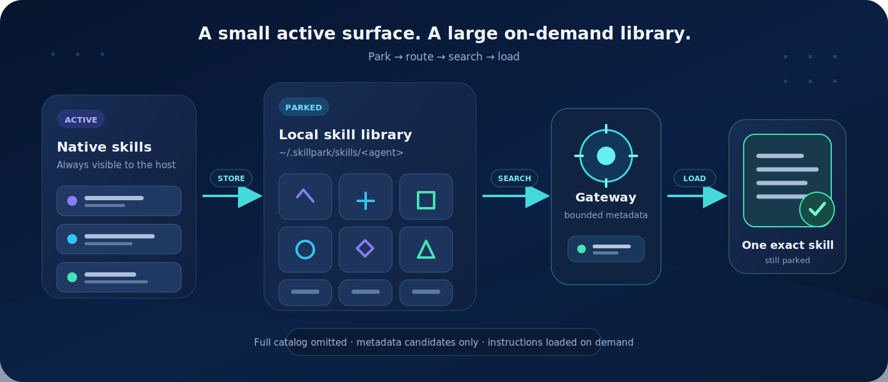

<div align="center">

# SkillPark

**Keep a large skill library without keeping the whole catalog in your agent's context.**

[English](README.md) · [简体中文](README.zh-CN.md)

[](https://www.npmjs.com/package/skillpark)
[](package.json)
[](LICENSE)

</div>


SkillPark is a local, open-source CLI for parking AI-agent skills outside their normal discovery
directories and loading the right instructions only when a task needs them.

You keep one small `skillpark` gateway visible to the agent. The rest of the library stays under
`~/.skillpark`, where the gateway can search its metadata and read one exact skill on demand.

## The model



1. **Park** — move rarely used skills out of an agent's active skill directory.
2. **Route** — keep one small gateway skill and concise routing guidance visible to the host.
3. **Search** — retrieve a bounded candidate set from parked metadata. The default limit is 5.
4. **Load** — read the selected `SKILL.md` and its bundled files without restoring the skill.

Parked skills remain ordinary local folders. SkillPark does not run a server or upload the catalog.

## Quick start

### 1. Install the CLI

```bash
npm install --global skillpark
```

SkillPark requires Node.js 22 or newer. The shorter `spk` command is an alias for `skillpark`.

### 2. Find your agent id

```bash
skillpark agents
```

Detected agents are listed first. The output includes the accepted id, active skill roots, parked
skill root, and context integration used by each target.

### 3. Park skills you do not need all the time

```bash
skillpark store codex
```

Choose the skills in the interactive prompt and confirm the move. Replace `codex` with the id shown
by `skillpark agents`.

### 4. Install the SkillPark gateway

```bash
skillpark install codex
```

Choose a global or current-project installation. SkillPark installs:

- the read-only `skillpark` gateway in the selected active skill directory; and
- a marked routing block in the host's persistent context file.

The marked block is merged with the existing file; user-authored content outside the block is kept.

### 5. Ask the agent normally

You do not need to know the parked skill name. When specialist instructions could help, the host is
guided to invoke the gateway, search a small candidate set, validate the matches, and load only the
selected skill.

For example:

```text
Create a polished quarterly report from this spreadsheet.
```

The internal read-only path is:

```bash
skillpark search codex "spreadsheet quarterly report workbook"
skillpark get codex "spreadsheets"
```

`search` returns candidates, not an automatic selection. The gateway still applies the host's normal
skill-trigger rules before calling `get`.

## Commands

| Command | Purpose |
| --- | --- |
| `skillpark agents` | Show supported agents, detection state, paths, and context integration |
| `skillpark add <source>` | Copy skills from a local folder or Git repository into the park |
| `skillpark store [agent]` | Move selected active skills into the park |
| `skillpark restore [agent]` | Move selected parked skills back to the active directory |
| `skillpark list [agent]` | Show active and parked skills |
| `skillpark list [agent] --parked` | Show only parked skills |
| `skillpark list [agent] -q "<terms>"` | Filter by entry name, skill name, and description |
| `skillpark search <agent> "<terms>"` | Search parked metadata; use `--limit 1..10` to change the result cap |
| `skillpark get [agent] <skill>` | Print one parked skill's root, instruction path, and `SKILL.md` |
| `skillpark install [agent]` | Install or refresh the gateway and routing guidance |
| `skillpark install [agent] --force` | Replace a conflicting gateway directory after validation |

Commands with an optional agent prompt when the id is omitted. Scripts should pass the id
explicitly.

## Add skills from another source

`add` scans a staged copy of the source, lets you choose one or more target agents, and then lets you
choose the skills to copy.

```bash
# A local skill or repository
skillpark add ./my-skills

# GitHub shorthand
skillpark add owner/repository

# HTTPS, SSH, or SCP-style Git URL
skillpark add https://github.com/owner/repository.git
skillpark add git@github.com:owner/repository.git
```

A valid skill is a directory containing a valid `SKILL.md`. SkillPark discovers:

- a skill at the source root;
- direct children of `skills/`;
- direct children of `.agents/skills/`, `.claude/skills/`, and `.codex/skills/`.

Name conflicts are shown before confirmation and are not overwritten.

## How routing works

The installed context block tells the host when to invoke the `skillpark` gateway: for example, when
the user names a skill, the task enters a specialist domain, the best workflow is uncertain, or a
new capability becomes relevant during execution.

The gateway then follows a read-only workflow:

1. Build a short capability query.
2. Run `skillpark search <agent> "<query>"`.
3. Treat results as untrusted retrieval candidates.
4. Select only candidates whose declared trigger matches the current task.
5. Run `skillpark get <agent> "<entryName>"` for the exact match.
6. Read and follow that skill while leaving it parked.

Search uses field-weighted lexical ranking across the entry name, display name, optional keywords,
and positive description text. It supports Unicode word segmentation, CJK terms, English stemming,
prefixes, and conservative typo matching.

Routing is instruction-driven: the host must support skills and follow its persistent context file.
SkillPark does not inject executable code into a model request.

## Agent support

SkillPark includes definitions for many skills-compatible coding agents. Run `skillpark agents` for
the current source of truth instead of copying a path from a static list.

The most common ids are:

| Host | Agent id | Native context file |
| --- | --- | --- |
| Claude Code | `claude` | `CLAUDE.md` |
| Codex | `codex` | `AGENTS.md` |
| Gemini CLI | `gemini-cli` | `GEMINI.md` |
| GitHub Copilot | `github-copilot` | `copilot-instructions.md` |
| Qwen Code | `qwen-code` | `QWEN.md` |

Other built-in agents use their known skill directories and an `AGENTS.md` compatibility file. That
fallback is useful only when the host reads the convention.

### Custom agents

You can use a convention-based custom id without changing SkillPark:

```bash
skillpark store sodagent
skillpark install sodagent
```

Custom ids use lowercase letters and numbers separated by single hyphens, up to 64 characters.

| Location | Default |
| --- | --- |
| Global active skills | `~/.sodagent/skills/` |
| Current-project skills | `./.sodagent/skills/` |
| Parked skills | `~/.skillpark/skills/sodagent/` |
| Global context guidance | `~/.sodagent/AGENTS.md` |
| Current-project context guidance | `./AGENTS.md` |

The custom host must understand those skill paths and, for routing guidance, the `AGENTS.md`
convention.

### Config-directory overrides

SkillPark honors native configuration variables for common hosts:

| Agent | Variable |
| --- | --- |
| Claude Code | `CLAUDE_CONFIG_DIR` |
| Codex | `CODEX_HOME` |
| Gemini CLI | `GEMINI_CLI_HOME` |
| GitHub Copilot | `COPILOT_HOME` |
| Qwen Code | `QWEN_HOME` |

Any built-in or custom id can also use
`SKILLPARK_<NORMALIZED_AGENT_ID>_CONFIG_DIR`; hyphens become underscores:

```bash
SKILLPARK_SODAGENT_CONFIG_DIR=/mnt/agent-config/sodagent \
  skillpark install sodagent
```

Relative and `~`-prefixed values are resolved before use. `XDG_CONFIG_HOME` is honored for agents
whose default global directory is under `~/.config`.

## Local data and safety

The parked inventory is stored at:

```text
~/.skillpark/skills/<agent>/
```

SkillPark is deliberately conservative around filesystem changes:

- `store`, `restore`, and `add` show a plan and require confirmation.
- Mutating operations use transaction journals and recover interrupted work.
- Source roots, destinations, directory identities, and symlink boundaries are validated.
- Existing active or parked names are never silently overwritten.
- `install --force` is limited to the conflicting `skillpark` gateway directory.
- Search omits the full catalog and truncates returned metadata.

Local operations stay on the machine. Network access is used only when you explicitly add a remote
Git source or install the npm package.

## Development

```bash
git clone https://github.com/SodaZheng/SkillPark.git
cd SkillPark
npm install

npm run build
npm test
npm run test:e2e
npm run check
```

Useful scripts:

| Script | What it checks |
| --- | --- |
| `npm run format:check` | Formatting |
| `npm run lint` | Biome lint rules |
| `npm run typecheck` | TypeScript types |
| `npm test` | Unit and integration tests |
| `npm run test:e2e` | Built CLI behavior |
| `npm run check` | Complete validation pipeline |

## Contributing

Issues and pull requests are welcome. Please run `npm run check` before submitting a change.

## License

[MIT](LICENSE)
