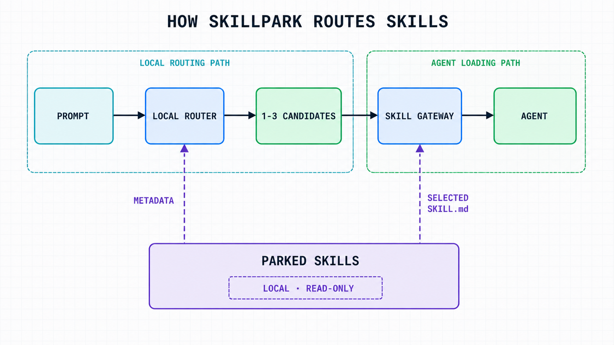

<div align="center">

# SkillPark

**让 Agent 拥有很大的技能库，同时保持很小的工作上下文。**

[English](README.md) · [简体中文](README.zh-CN.md)

[](package.json)
[](package.json)
[](LICENSE)
[](https://www.typescriptlang.org/)

</div>


SkillPark 是一个本地运行的开源 CLI，用来统一管理多个 AI 编程 Agent 的技能。它把不常用
的技能移出 Agent 的常规发现目录，根据请求在本地检索停放技能的元数据，并且只加载真正
匹配当前任务的少量技能。

它把问题拆成三个彼此独立的部分：**保存大量技能、只暴露一个轻量路由入口、仅在需要时
加载完整指令。**

## 为什么需要 SkillPark？

AI Agent 通常会扫描一个或多个活动技能目录来发现技能。当技能数量较少时，这种方式非常
直接；但随着技能库增长，每个始终可见的技能描述都会占用上下文并参与选择，即使大部分
技能与当前请求完全无关。

SkillPark 围绕三个目标设计：

1. **减少常驻技能上下文。** 把非活跃技能停放到 Agent 原生发现路径之外。
2. **保留按需访问能力。** 在本地完成路由，只向 Agent 暴露经过置信度筛选的少量候选。
3. **让用户掌握控制权。** 文件系统操作透明，提供交互选择、冲突检查和可恢复事务。

| 不使用 SkillPark | 使用 SkillPark |
| --- | --- |
| 每轮都可能发现所有活动技能 | 常驻的只有轻量 SkillPark 网关 |
| 完整技能目录都可能参与选择 | 本地路由默认最多返回 3 个候选 |
| 需要手动移除、重新放回技能 | 用同一个 CLI 停放、恢复、新增和检查技能 |
| 需要手工维护不同 Agent 的 Hook 配置 | 对支持的 Agent 使用原生适配器合并只读 Hook |

## 主要功能

- **按需加载** — 停放技能不会进入 Agent 的原生扫描，只有被选中时才读取完整指令。
- **确定性的本地路由** — 支持中英文 Unicode 分词、显式调用、别名、英文词形归一、稀有度
  加权以及保守的拼写纠错。
- **有界上下文** — 不把完整目录交给 Agent；经过置信度筛选后，默认最多只返回 3 个候选。
- **73 个 Agent 目标** — 覆盖广泛的 AI 编程 Agent，并定义对应的技能路径与检测规则。
- **原生 Prompt Hook** — 内置 Claude Code、Codex、Gemini CLI、Qwen Code 和 GitHub
  Copilot 适配器。
- **完整技能生命周期** — 支持从本地或 Git 来源新增技能、停放、恢复、查看目录以及精确加载
  单个技能。
- **安全的文件系统操作** — 名称冲突保护、路径边界检查、事务日志、失败回滚以及中断后的
  守护式恢复。
- **友好的终端交互** — 优先显示已检测到的 Agent，并为 Agent、技能和安装范围提供可搜索的
  键盘选择器。

## 工作原理



1. 技能保存在 `~/.skillpark/skills/<agent>/`，位于该 Agent 的活动发现目录之外。
2. 原生 Prompt Hook 会把请求交给本地路由器；没有原生适配器时，则由已安装的网关技能
   执行同样的路由流程。
3. 路由器只读取停放技能的元数据，返回置信度达标且排名靠前的候选；正常 Hook 流程使用
   精度优先的默认上限 3。
4. 网关继续应用宿主 Agent 原本的技能触发规则，并通过
   `skillpark get <agent> <entryName>` 精确加载最终匹配项。
5. 当前任务使用被选中的 `SKILL.md`，技能目录本身仍然保持停放状态。

整个过程不依赖远程路由服务或目录数据库。只有在你明确新增 Git 来源时才需要 Git 网络访问。

## 环境要求

- Node.js 22 或更高版本
- npm（用于全局安装）
- 仅从 Git 仓库新增技能时需要 Git

## 自定义 Agent 配置目录

SkillPark 会读取 Agent 自己的配置目录环境变量，因此自定义的全局技能目录和 Hook 配置不会
被误写回默认的 home 目录：

| Agent | 原生环境变量 | SkillPark 解析结果 |
| --- | --- | --- |
| Claude Code | `CLAUDE_CONFIG_DIR` | `<value>/skills`、`<value>/settings.json` |
| Codex | `CODEX_HOME` | `<value>/skills`、`<value>/hooks.json` |
| Gemini CLI | `GEMINI_CLI_HOME` | `<value>/.gemini/skills`、`<value>/.gemini/settings.json` |
| Qwen Code | `QWEN_HOME` | `<value>/skills`、`<value>/settings.json` |

所有支持的 Agent 还可以使用统一覆盖变量
`SKILLPARK_<AGENT_ID>_CONFIG_DIR`；其中 Agent id 转成大写，并把连字符替换为下划线。例如：

```bash
export SKILLPARK_CLAUDE_CONFIG_DIR=~/home/soda/.claude
export SKILLPARK_GITHUB_COPILOT_CONFIG_DIR=/mnt/agent-config/copilot
skillpark agents
```

统一覆盖变量直接指向该 Agent 的配置根目录。SkillPark 会保留目标原有的技能子目录布局；
例如 AstrBot 仍使用 `<config>/data/skills`。对于默认位于 `~/.config` 下的目标，SkillPark
也会识别 `XDG_CONFIG_HOME`。优先级为 SkillPark 专用覆盖、Agent 原生变量、
`XDG_CONFIG_HOME`、默认 home 路径。`~` 会按当前用户 home 展开，相对路径按当前工作目录
解析。

自定义配置根目录必须已经存在且是普通目录，不能是符号链接。项目级技能路径和
`~/.skillpark/skills/<agent>/` 停放目录不受这些变量影响。

## 安装

```bash
npm install -g skillpark
```

安装后可以使用两个等价的命令名：

```bash
skillpark --version
spk --version
```

## 快速开始

### 1. 查看可用的 Agent

```bash
skillpark agents
```

已经检测到的 Agent 会优先显示。表格还会列出可接受的 Agent id、原生 Hook 支持情况、
活动目录和停放目录。

### 2. 把技能放进停车场

停放某个 Agent 当前已经激活的技能：

```bash
skillpark store codex
```

也可以从本地目录或 Git 仓库直接把技能加入 SkillPark：

```bash
skillpark add ./my-skills
skillpark add owner/repository
skillpark add https://github.com/owner/repository.git
```

`add` 会先询问目标 Agent，再让你选择来源中发现的技能。活动目录或停放目录中存在同名
目录时，SkillPark 不会覆盖它。

### 3. 安装网关

```bash
skillpark install codex
```

在交互界面中选择 `Global` 或 `Current project`。SkillPark 会安装一个很小的只读网关技能；
如果所选 Agent 有原生适配器，还会合并对应的 Prompt Hook。

### 4. 继续正常提问

安装 Hook 后，普通请求会自动路由。也可以手动检查路由结果：

```bash
skillpark route codex "创建一个 Excel 工作簿"
skillpark route codex --limit 1 "起草一份合同"
```

或者显式调用某个停放技能：

```text
# Codex
$skillpark documents create a contract draft

# Claude Code
/skillpark /documents create a contract draft
```

对于 `skillpark get`，`/documents` 前面的斜杠可以省略；网关会在加载精确目录项前完成归一化。

## 命令参考

| 命令 | 用途 |
| --- | --- |
| `skillpark agents` | 列出所有支持的 Agent、检测状态、路径和 Hook 支持情况 |
| `skillpark add <source>` | 在本地或 Git 来源中发现技能，并把选中的技能复制到选定 Agent 的停放目录 |
| `skillpark store [agent]` | 把选中的活动技能移动到该 Agent 的停放目录 |
| `skillpark restore [agent]` | 把选中的停放技能移回该 Agent 的活动目录 |
| `skillpark list [agent]` | 列出活动与停放技能、名称冲突和元数据警告 |
| `skillpark list [agent] --parked` | 只显示停放技能 |
| `skillpark list [agent] -q <query>` | 过滤当前显示的目录 |
| `skillpark install [agent]` | 安装网关技能，并在支持时安装原生 Hook |
| `skillpark install [agent] --force` | 只原子替换冲突的网关技能；Hook 设置仍然采用合并方式 |
| `skillpark route <agent> "<query>"` | 不加载技能，仅查看有界的本地路由结果 |
| `skillpark route <agent> --limit <1-10> "<query>"` | 修改诊断命令返回候选的最大数量 |
| `skillpark get [agent] <skill>` | 输出一个停放技能的根目录、指令文件路径和完整 `SKILL.md` |

交互命令省略 Agent 参数时，SkillPark 会要求你进行选择；脚本和自动化仍可显式传入 Agent id。

## 支持的技能来源

`skillpark add` 接受以下来源：

```bash
# 本地目录
skillpark add ./skills

# GitHub 简写
skillpark add owner/repository

# HTTPS、SSH URL 或 SCP 风格 Git URL
skillpark add https://github.com/owner/repository.git
skillpark add git@github.com:owner/repository.git
```

SkillPark 会识别来源根目录中的技能，也会扫描 `skills/`、`.claude/skills/`、
`.agents/skills/` 和 `.codex/skills/` 等常见容器。合法技能必须是一个包含 `SKILL.md` 的
目录，并且文件的 YAML frontmatter 中要有非空的 `name` 与 `description`。

## 支持的 Agent

SkillPark 当前定义了 73 个 Agent 目标。`claude-code` 是 `claude` 的别名。Eve 和
PromptScript 仅支持项目范围；其他目标使用各自 Agent 定义中声明的技能根目录。

<details>
<summary>展开全部 Agent id</summary>

```text
aider-desk amp antigravity antigravity-cli astrbot autohand-code augment bob
claude openclaw cline codearts-agent codebuddy codemaker codestudio codex
command-code continue cortex crush cursor deepagents devin dexto droid eve
firebender forgecode gemini-cli github-copilot goose hermes-agent inference-sh
jazz junie iflow-cli kilo kimi-code-cli kiro-cli kode lingma loaf mcpjam
mistral-vibe moxby mux opencode openhands ona pi qoder qoder-cn qwen-code replit
reasonix rovodev roo tabnine-cli terramind tinycloud trae trae-cn warp windsurf
zed zcode zencoder zenflow neovate pochi promptscript adal universal
```

</details>

## 原生 Hook 支持

| Agent | 事件 | 全局配置 | 项目配置 |
| --- | --- | --- | --- |
| Claude Code | `UserPromptSubmit` | `~/.claude/settings.json` | `./.claude/settings.json` |
| Codex | `UserPromptSubmit` | `~/.codex/hooks.json` | `./.codex/hooks.json` |
| Gemini CLI | `BeforeAgent` | `~/.gemini/settings.json` | `./.gemini/settings.json` |
| Qwen Code | `UserPromptSubmit` | `~/.qwen/settings.json` | `./.qwen/settings.json` |
| GitHub Copilot | `userPromptTransformed` | `~/.copilot/settings.json` | `./.github/copilot/settings.json` |

对于其他 Agent，`install` 只安装网关技能并跳过 Hook 配置。SkillPark 不会把某一个宿主的
Hook 格式当成其他宿主的兜底方案。

Hook 安装是幂等的：已有设置和无关 Hook 分组都会保留；无效 JSON 会被拒绝，而不是被
覆盖。请确保全局安装的 `skillpark` 命令位于 Agent 进程的 `PATH` 中。Hook 会在运行时解析
该命令，因此 CLI 升级后不会留下过期的绝对可执行路径。

> Codex 可能会要求你通过 `/hooks` 检查并信任新安装的 Hook；项目 Hook 还要求当前项目
> 本身处于受信任状态。

## 网关安装路径

下面是部分代表性路径。停放技能始终位于 `~/.skillpark/skills/<agent>/`。

| Agent | 范围 | 网关技能路径 |
| --- | --- | --- |
| Claude Code | 全局 | `~/.claude/skills/skillpark/` |
| Claude Code | 当前项目 | `./.claude/skills/skillpark/` |
| Codex | 全局 | `~/.codex/skills/skillpark/` |
| Codex | 当前项目 | `./.agents/skills/skillpark/` |
| Gemini CLI | 全局 | `~/.gemini/skills/skillpark/` |
| Gemini CLI | 当前项目 | `./.agents/skills/skillpark/` |
| Qwen Code | 全局 | `~/.qwen/skills/skillpark/` |
| Qwen Code | 当前项目 | `./.qwen/skills/skillpark/` |
| GitHub Copilot | 全局 | `~/.copilot/skills/skillpark/` |
| GitHub Copilot | 当前项目 | `./.agents/skills/skillpark/` |

SkillPark 没有 `--current` 参数，安装范围需要在交互界面中选择。`--force` 只作用于网关技能
目录，不会覆盖其他 Hook 设置。

## 路由行为

路由器是确定性的、离线的，并且以精度为优先目标。它会组合使用：

- 显式目录项调用；
- Unicode 感知的分词；
- 技能名称和描述权重；
- 常见中英文能力概念；
- 英文词形归一；
- 当前目录内的词项稀有度；
- 保守的拼写相似度；
- 置信度阈值以及候选与最高分的距离。

没有匹配项时，Hook 只返回一个很短的标记，不会输出目录。候选元数据会被视为不可信输入；
网关仍然会先应用宿主 Agent 原本的技能触发规则，再决定是否加载内容。

技能作者可以添加仅用于路由的别名，而不必修改展示给用户的描述：

```yaml
---
name: documents
description: Create and edit Word documents.
routing:
  aliases:
    - 写合同
    - contract drafting
---
```

## 安全与隐私

- **本地优先：** 目录扫描和路由都在本机完成。
- **只读 Hook 边界：** 已安装的 Hook 只路由元数据并输出加载指令，不会运行 `store`、
  `restore`、`add` 或 `install`。
- **禁止静默覆盖：** 移动或复制前会禁用活动目录和停放目录中的同名冲突项。
- **守护式路径检查：** 敏感文件操作前会验证来源与目标边界、目录项名称、符号链接和物理
  对象身份。
- **可恢复修改：** 事务进行期间，短生命周期日志会保存在
  `~/.skillpark/.transactions/`；事务完成后即删除。
- **保守恢复：** 如果所有权或路径证据发生变化，SkillPark 会停止并要求手动清理，而不是
  删除未经验证的路径。

## 键盘操作

| 按键 | 操作 |
| --- | --- |
| 上 / 下 | 移动选中项 |
| Space | 切换当前选项 |
| `a` | 选择或清空当前可见的全部选项 |
| `/` | 搜索选项 |
| Enter | 继续 |
| Escape 或 Ctrl+C | 安全取消 |

设置 `NO_COLOR=1` 可以关闭终端颜色。

## 本地开发

```bash
git clone https://github.com/SodaZheng/SkillPark.git
cd SkillPark
corepack enable
pnpm install
pnpm build
```

常用检查命令：

```bash
pnpm format:check
pnpm lint
pnpm typecheck
pnpm test
pnpm test:e2e

# 运行完整验证流程
pnpm check
```

## 参与贡献

欢迎提交 Issue 和 Pull Request。报告 Bug 时，请附上 Agent id、执行命令、预期行为、实际
输出、操作系统和 Node.js 版本。提交 Pull Request 前请运行 `pnpm check`。

- [报告问题或提出功能建议](https://github.com/SodaZheng/SkillPark/issues)
- [查看源码仓库](https://github.com/SodaZheng/SkillPark)

## 许可证

[MIT](LICENSE) © 2026 Soda
